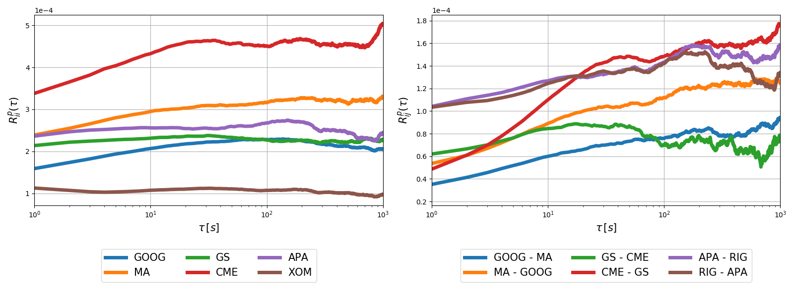
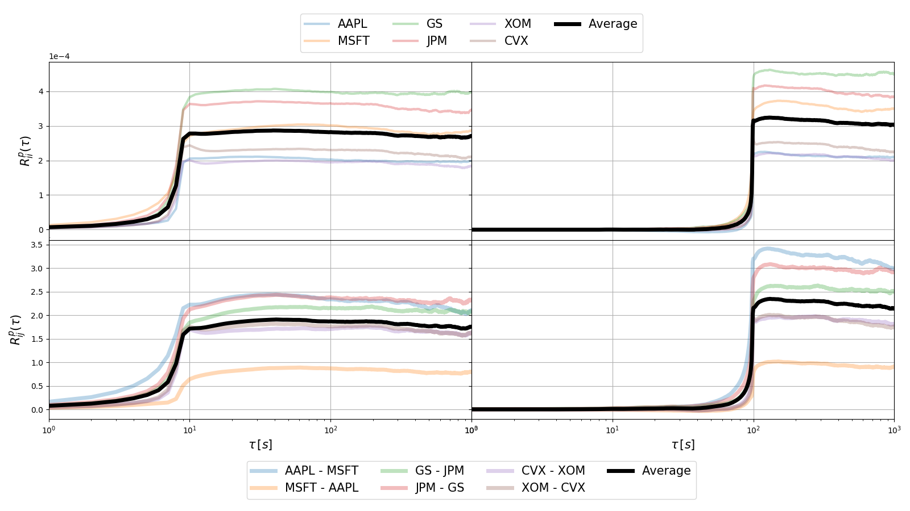
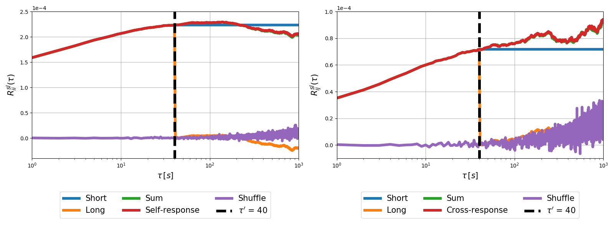

# Response Functions Analysis

[](https://www.python.org/)
[](https://financial-response-spread-year.readthedocs.io/en/latest/)

In this repository, I analyze the response functions of the NASDAQ TAQ data for
the year 2008, however, it is possible to analyze other years with the
corresponding data.

I reproduce in the [taq_responses_physical](https://github.com/juanhenao21/financial_response_spread_year/tree/master/project/taq_responses_physical)
folder the sections 3.1 and 3.2 of the paper
[Cross-response in correlated financial markets: individual stocks](https://link.springer.com/content/pdf/10.1140/epjb/e2016-60818-y.pdf)
to obtain the midpoint prices, trade signs, self-responses, cross-responses,
trade sign self-correlators and trade sign cross-correlators values for
different stocks.

Based on these values, I analyze responses functions in trade time scale
([taq_responses_trade](https://github.com/juanhenao21/response_functions_year/tree/master/project/taq_responses_trade/taq_algorithms))
and the influence of the number of trades in a second in the response functions
([taq_responses_activity](https://github.com/juanhenao21/response_functions_year/tree/master/project/taq_responses_activity/taq_algorithms)).
I also analyze the influence of the time shift between trade signs and midpoint
prices
([taq_physical_shift](https://github.com/juanhenao21/response_functions_year/tree/master/project/taq_physical_shift/taq_algorithms),
[taq_responses_physical_shift](https://github.com/juanhenao21/response_functions_year/tree/master/project/taq_responses_physical_shift/taq_algorithms),
[taq_trade_shift](https://github.com/juanhenao21/response_functions_year/tree/master/project/taq_trade_shift/taq_algorithms)
and
[taq_responses_trade_shift](https://github.com/juanhenao21/response_functions_year/tree/master/project/taq_responses_trade_shift/taq_algorithms))
and the influence of the time lag
([taq_responses_physical_short_long](https://github.com/juanhenao21/response_functions_year/tree/master/project/taq_responses_physical_short_long/taq_algorithms))
in the response functions.

You can find [here](https://financial-response-spread-year.readthedocs.io/en/latest/)
a detailed documentation of the code.

## Getting Started

The main code is implemented in `Python`. As we use the TAQ data format, it is
necessary to extract the data to a readable format. To do that, is used a `C++`
module, however, all this process is automated with `Python`.

If you are interested in test the code, you can write me asking for some data
files examples, so we can share the files with you.

### Prerequisites

For `Python`, all the packages needed to run the analysis are in the
`requirements.txt` file.

For the `C++` module compilation I used the `g++` compiler. It is necessary to
install the `-lboost_date_time` and the `armadillo-3.920.3` module (only for
Research group Guhr members).

## Running the code

The first step is to clone the repository

```bash
$ git clone https://github.com/juanhenao21/financial_response_spread_year.git
```

To install all the `Python` packages needed I recommend to create a virtual
environment and install them from the `requirements.txt` file. To install the
packages from terminal, you can use

```bash
$ virtualenv -p python3 env
$ source env/bin/activate
$ pip install -r requirements.txt
```

### TAQ Responses Physical

After you clone the repository, you need to create two folders inside the
`financial_response_spread_year/project` folder, one folder with the name
`taq_data` and another folder with the name `taq_plot`.

#### For the members of the research group Guhr

To run the code from the scratch and reproduce the results in section 2.3 and
2.4 of the
[paper](https://link.springer.com/content/pdf/10.1140/epjb/e2016-60818-y.pdf),
you need to copy the folder `decompress_original_data_2008` to the folder
`financial_response_spread_year/project/taq_data`.
Then you need to create a folder with the name `original_year_data_2008` inside
`financial_response_spread_year/project/taq_data` and move the `.quotes` and
`.trades` files of the tickers you want to analyze. Make sure you move a copy
of the files and not the originals, because when you run the code, it will
delete these files to free space.

Then, you need to move (cd) to the folder
`financial_response_spread_year/project/taq_responses_physical/taq_algorithms/`
and in the `main()` function of the module
`taq_data_main_responses_physical.py`, edit the tickers list with the stocks
you want to analyze (in this case the symbols of the files of the tickers you
copy in the previous step).

```Python
tickers = ['AAPL', 'MSFT']
```

Finally, you need to run the module. In Linux, using the terminal the command
looks like

```bash
$ python3 taq_data_main_responses_physical.py
```

The program will obtain and plot the data for the corresponding stocks.

#### For the users with the year CSV data files

If you have the CSV data files, you need to create a folder with the name
`csv_year_data_2008` inside `financial_response_spread_year/project/taq_data`,
and move the CSV files inside.  Make sure you move a copy of the files and not
the originals, because when you run the code, it will delete these files to
free space. Then go to the
`financial_response_spread_year/project/taq_responses_physical/taq_algorithms/taq_data_main_responses_physical.py`
file and comment the line in the `main` function

```Python
# taq_build_from_scratch(tickers, year)
```

Edit the tickers list with the stocks you want to analyze (in this case the
symbols of the files of the tickers you copy in the previous step).

```Python
tickers = ['AAPL', 'MSFT']
```

Finally, you need to run the module. In Linux, using the terminal, the command
looks like

```bash
$ python3 taq_data_main_responses_physical.py
```

The program will obtain and plot the data for the corresponding stocks.

All the following analysis depend directly from the results of this section. If
you want to run them, you need to run this section first.

### TAQ Responses Trade

To run this part of the code, you need to move (cd) to the folder
`response_functions_year/project/taq_responses_trade/taq_algorithms/` and run
the module `taq_data_main_responses_trade.py`. In Linux, using the terminal the
command looks

```bash
$ python3 taq_data_main_responses_trade.py
```

### TAQ Responses Activity

To run this part of the code, you need to move (cd) to the folder
`response_functions_year/project/taq_responses_activity/taq_algorithms/` and
run the module `taq_data_main_responses_activity.py`. In Linux, using the
terminal the command looks

```bash
$ python3 taq_data_main_responses_trade.py
```

### TAQ Time Shift

The TAQ time shift analysis is divided in two time scales and in two modules.
The modules have to be ran in the order shown.

#### Physical time scale

To run this part of the code, you need to move (cd) to the folder
`response_functions_year/project/taq_physical_shift/taq_algorithms/` and run
the module `taq_data_main_physical_shift.py`. In Linux, using the terminal the
command looks

```bash
$ python3 taq_data_main_physical_shift.py
```

After run the `taq_data_main_physical_shift.py` module, you can move (cd) to
the folder
`response_functions_year/project/taq_responses_physical_shift/taq_algorithms/`
and run the module `taq_data_main_responses_physical_shift.py`. In Linux, using
the terminal the command looks

```bash
$ python3 taq_data_main_responses_physical_shift.py
```

#### Trade time scale

To run this part of the code, you need to move (cd) to the folder
`response_functions_year/project/taq_trade_shift/taq_algorithms/` and run the
module `taq_data_main_trade_shift.py`. In Linux, using the terminal the
command looks

```bash
$ python3 taq_data_main_trade_shift.py
```

After run the `taq_data_main_trade_shift.py` module, you can move (cd) to the
folder
`response_functions_year/project/taq_responses_trade_shift/taq_algorithms/`
and run the module `taq_data_main_responses_trade_shift.py`. In Linux, using
the terminal the command looks

```bash
$ python3 taq_data_main_responses_trade_shift.py
```

### TAQ Responses Short Long

To run this part of the code, you need to move (cd) to the folder
`response_functions_year/project/taq_responses_physical_short_long/taq_algorithms/`
and run the module `taq_data_main_responses_physical_short_long.py`. In Linux,
using the terminal the command looks

```bash
$ python3 taq_data_main_responses_physical_short_long.py
```

## Expected results

For the response functions, an increase to a maximum followed by a slowly
decrease is expected.



In the time shift analysis, a change in the relative position between returns
and trade signs can vanish the response function signal.



Finally, dividing the time lag used in the returns, we obtain a short and long
response function, where the short component has a large impact compared with
the long component.



## Authors

* **Juan Camilo Henao Londono** - *Initial work* - [Website](https://juanhenao21.github.io)

## Acknowledgments

* Research Group Guhr
* DAAD Research Grants - Doctoral Programmes in Germany
